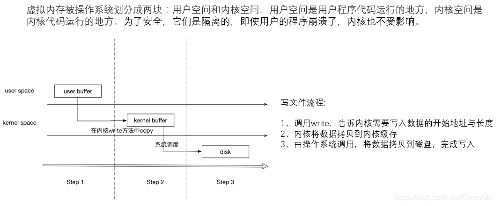
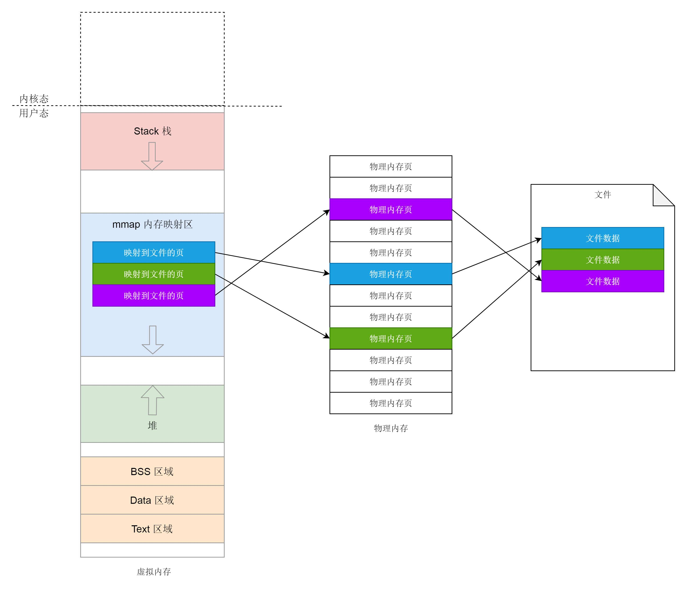
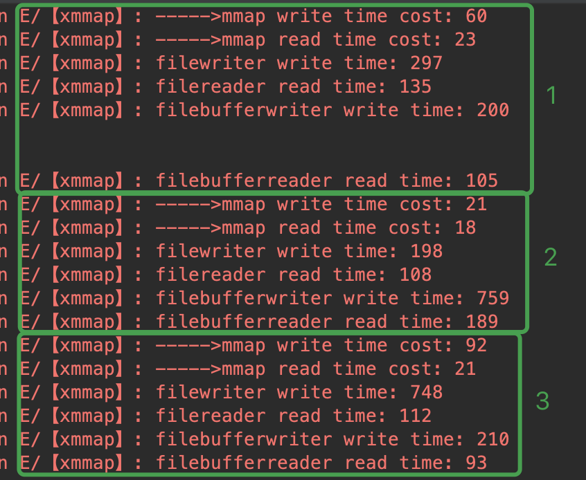

# XMmap

功能完善的mmap实现，支持写、读、追加。☺️

## 传统文件操作方式

在Linux系统中把内存分为内核空间和用户空间，其中内核空间为所有进程共享，而用户空间则是进程私有的（比如说在32位系统时，总内存大小为4G，那么内核空间的大小为1G，3G为用户空间，理论上意味着进程可以使用的内存上限为3G，如果真的有一个进程已经占用了3G，那么就无法再启动其他进程了，因为内存不足了），而我们的程序是首先在用户空间上运行，直到系统调用才进到内核空间，进程之间不能直接通信，它们想要通信必须得经过内核空间。

所以传统（直接）I/O通过read和write实现的具体流程是：**首先是从当前进程的用户空间把I/O流复制到内核空间中的高速缓存区，再由内核去把内核空间中的流复制到磁盘，无论是同步还是异步还是直接I/O方式都需要经过“2次”复制。**

## mmap的原理
存储映射 I/O 全称`memory-mapped I/O`能够将磁盘文件映射到内存中的一个缓冲区上（即真实的内存地址与文件数据一一对应）。那么经过存储映射之后，当从内存缓冲区中读取数据时，就相当于是读取文件中的对应的字节数据，而将数据写入缓冲区时，操作系统会自动帮你把对应的数据写到磁盘文件中，进而避免了传统的read和write方式执行I/O。此外存储映射I/O常被用在进程间通信时提供共享存储区。

**需要注意的是Linux采用的是分页来管理内存，意味着在内存管理时，是以页为基本单位的（一般32位的系统一页的大小为4096个字节），即映射也是基于页的。**

> 页大小（Page），Linux系统中是按照页来管理内存的，页是内核内存管理单元（MMU）的粒度单位，它也是内存中允许有不同权限和行为的最小单元，页是内存映射的基本块，因而也是进程地址空间的基本块。mmap系统调用的操作单元是以页为基础的，因此参数addr和__offset必须按页大小对齐即大小必须是整数倍，换言之，映射区域的大小是也大小的整数倍，若调用方提供的len参数没有按页对齐，映射区域会一直占满最后一个页，多出来的内存即最后一个有效字节到映射区域边界这部分的空间，会被0填充，对该区域的所有读操作都将返回0。

### mmap的优点

* 传统的read()或write()调用，需要从用户缓冲区进行数据读写，而使用映射文件进行操作，可以避免1次数据拷贝操作
* 除了可能潜在的缺页中断，读写映射文件不会带来系统调用和上下文切换的开销
* 在映射文件中搜索时只需要简单的指针操作，不需要使用系统调用lseek()
* 当多个进程把同一个对象映射到内存中时，数据会在所有进程间共享

### mmap的缺点

* 由于映射区域的带下必须是页大小的整数倍，因此，文件实际大小和页大小之间会有空间浪费，这个对于小文件就更为明显
* 存储映射区域必须在进程地址空间内。对于32位地址空间，大量的大小不同的映射会导致大量的碎片
* 创建和维护映射以及相关的内核数据结构也有一定的开销。不过，这种开销对于文件拷贝来说可以忽略，对大文件和频繁访问的文件更是如此

**综上：mmap适合处理大文件，或者文件大小是PAGE的整数倍的时候。**

## 具体实现

## 性能对比

对比了如下读写文件的方式：

* mmap
* FileWriter / FileReader
* BufferedWriter / BufferedReader

## 参考

[文件写入的6种方法](https://segmentfault.com/a/1190000038575475)

[JNI常用类型转换](https://juejin.cn/post/6844903734070214663)

[String, char*, and jstring conversions in JNI](https://www.programmersought.com/article/97481500908/)

[Android NDK——实战演练之从零到零点八真正详解存储映射mmap（一）](https://blog.csdn.net/CrazyMo_/article/details/87626248)

[Android NDK——实战演练之从零到零点八Android中借助mmap实现I/O（二）](https://blog.csdn.net/CrazyMo_/article/details/87863531)

